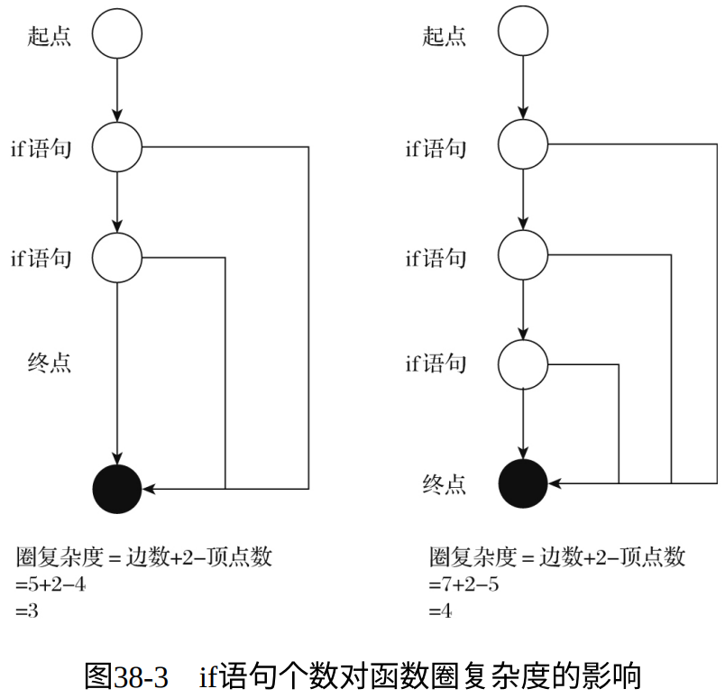
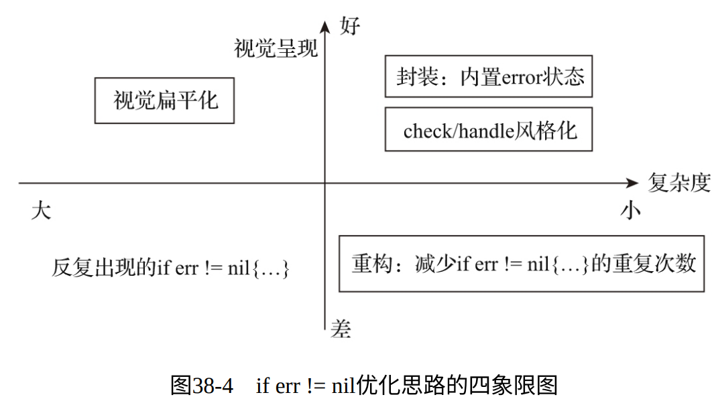

# 两种观点

- 有一些Go程序员认为：Go错误处理方式在某些时候显得过于冗长甚至啰嗦，并希望Go核心团队接受并实现try设计草案

- 但一些知名Go程序员却给出了不一样的观点：

    1. 知名Go程序员Dave Cheney在其博客文章“Go语言之禅” 中直言不讳地表达了自己的观点：

        > - Go的成功很大程度上要归功于显式的处理错误方式，因为它让Go 程序员首先考虑失败情况，这将引导Go程序员在编写代码时处理故障，而不是在程序部署并运行在生产环境后再处理。而为反复出现的代码片段if err != nil {...}所付出的成本已基本被在故障发生时处理故障的成本超过。

    2. Go语言之父Rob Pike在2019年的Go Sydney聚会上的演讲中谈及Go 2的变化，他认为if err != nil在代码库中的使用远没有少数人所说的那么普遍。

    3. 著名Go培训师、《Go语言实战》一书的合著者William Kennedy更是在Go开发团队的try提案公示之后发表了对Go社区的公开信。他认为当时的Go用户调查结果可能夸大了人们对错误处理的抱怨，而这些变化可能并不是大多数Go开发人员真正想要或需要的。同时他希望Go开发团队不要接受这个try提案，因为它引入了两种方法来完成相同的事情，这与Go完成一种事情仅有一种方法的原则相背离， 会导致代码库中出现严重的不一致。

- 最终Go核心团队否决了大部分之前编写的关于Go错误处理改善的设计草案。


# 尽量优化

- 但是Go核心团队的技术负责人Russ Cox也承认 **<u>“当前的Go错误处理机制对于Go开发人员来说确实会有一些心智负担。”</u>**

- 另一名Go核心开发团队成员Marcel van Lohuizen也对if err != nil的重复出现情况进行了研究。他发现代码所在栈帧越低，if err != nil就越不常见；反之，代码在栈中的位置越高（更接近于网络I/O操作或操作系统API调用），if err != nil就越常见。不过该开发人员也认为，可以通过良好的设计减少或消除这类反复出现的错误检查。
- 总之，我们需要对反复出现的 if err != nil 尽可能优化。其根本目的是 <u>**让错误检查和处理较少，不要干扰正常业务代码，让正常业务代码更具视觉连续性。**</u>


# 优化思路

## 改善代码的视觉呈现（无法实现）

此方法本质上是提供一种改善代码视觉呈现的语法糖，让错误处理代码在开发者眼中的视觉呈现更加优雅：

```go
func SomeFunc() error {
    err := doStuff1()
    if err != nil {
        // 处理错误
    }
    
    err = doStuff2()
    if err != nil {
        // 处理错误
    }
 
    err = doStuff3()
    if err != nil {
        // 处理错误
    }
}
// 修改后，由于try提案被否决，我们无法实现
func SomeFunc() error {
    defer func() {
        if err != nil {
            // 处理错误
        }
    }()
    try(doStuff1())
    try(doStuff2())
    try(doStuff3())
}
```

## 降低 if err != nil 重复的次数

- 一个函数/方法内部出现多少个if err != nil才需要我们去优化和消除这种代码重复呢？这显然没有标准可言。有一个粗略的评估方法： 利用 **<u>圈复杂度（Cyclomatic complexity）</u>** 。

- 圈复杂度是一种代码复杂度的衡量标准，我们常用它来衡量一个模块判定结构的复杂程度。圈复杂度高，说明程序代码可能质量低且难于测试和维护。根据经验，程序的可能错误与高的圈复杂度有着很大关系。

- 圈复杂度可以通过程序控制流图计算，公式为

- $$
    V(G) = e + 2 - n
    $$

- 其中：e为控制流图中边的数量；n为控制流图中节点的数量。



现实中的真实优化实施更多是上述两个方向的结合，这里用下图所示的四象限图来直观展示可能的优化思路：

