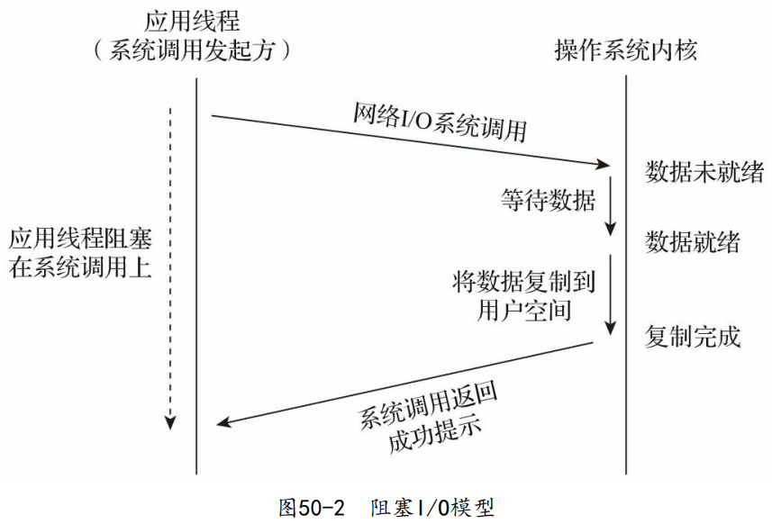
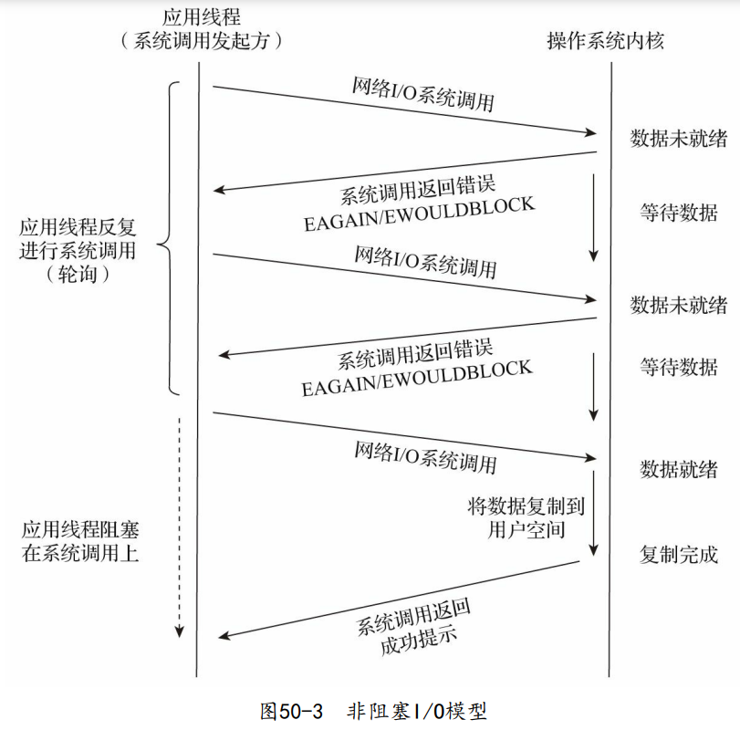
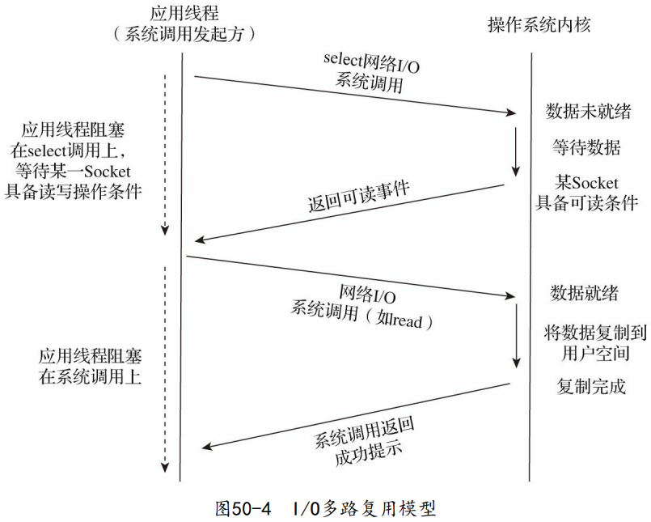
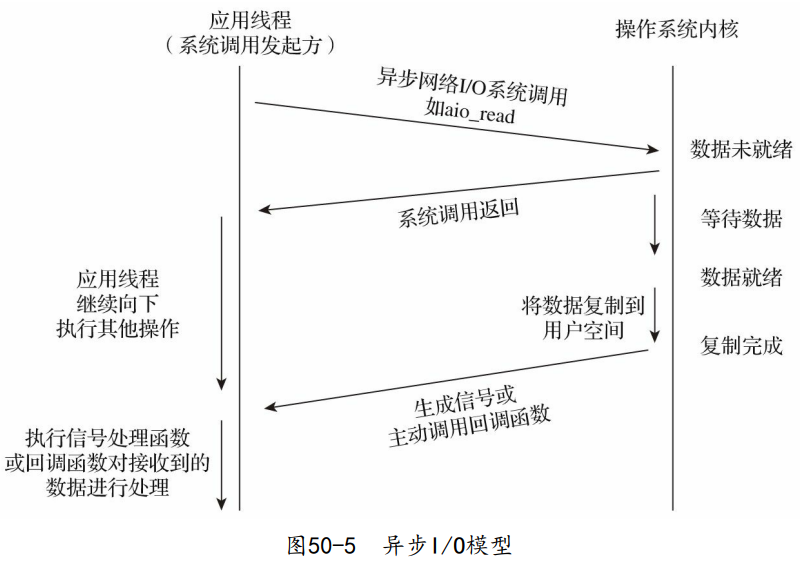

> Go是自带运行时的跨平台编程语言，Go中暴露给语言使用者的TCP Socket接口是建立在操作系统原生TCP Socket接口之上的。由于Go运行时调度的需要，Go设计了一套适合自己的TCP Socket网络编程模型。

# TCP Socket 网络编程模型

网络I/O模型定义的是应用线程与操作系统内核之间的交互行为模式。

## 阻塞I/O模型

## 非阻塞I/O模型

## I/O多路复用模型

## 异步I/O模型

---

> - Go语言的设计者结合Go语言的自身特点，将 **I/O多路复用** 的“复杂性”隐藏在了Go运行时中。这样，在大多数情 况下，Go开发者无须关心Socket是不是阻塞的，也无须亲自将Socket文件描述符的回调函数注册到类似select这样的系统调用中，而只需在每个连接对应的goroutine中以最简单、最易用的阻塞I/O模型的方式进行Socket操作即可，这种设计大大减轻了网络应用开发人员的心智负担。
> - 在Go程序的用户层（相对于Go运行时层）看来，goroutine采用 了“阻塞I/O模型”进行网络I/O操作，Socket都是“阻塞”的。但实际上，这样的假象是Go运行时中的netpoller（网络轮询器）通过I/O多路复用机 制模拟出来的，对应的底层操作系统Socket实际上是非阻塞的。

# TCP连接的建立